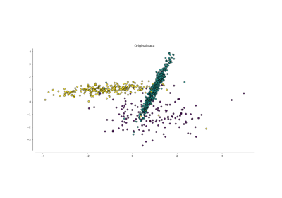
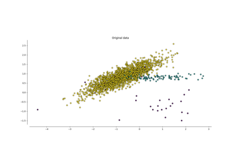

<!-- docs_generated_gallery -->

# General examples

A collection of examples for clustering-based over-sampling.

    <!--div class="figure align-default" id="id1"-->
        
        

            
                <a class="reference internal" href="plot_kmeans_smote">
                    KMeans-SMOTE algorithm
                </a>
            
            <!--a class="headerlink" href="#id1" title="Permalink to this image"></a-->
        

    <!--/div-->

    <!--div class="figure align-default" id="id1"-->
        
        

            
                <a class="reference internal" href="plot_cluster_oversamplers">
                    Clustering-based over-sampling
                </a>
            
            <!--a class="headerlink" href="#id1" title="Permalink to this image"></a-->
        

    <!--/div-->

[:fontawesome-solid-download: Download all examples in Python source code: gallery_python.zip](./gallery_python.zip){ .md-button .center}

[:fontawesome-solid-download: Download all examples in Jupyter notebooks: gallery_jupyter.zip](./gallery_jupyter.zip){ .md-button .center}

[Gallery generated by mkdocs-gallery](https://mkdocs-gallery.github.io){: .mkd-glr-signature }
