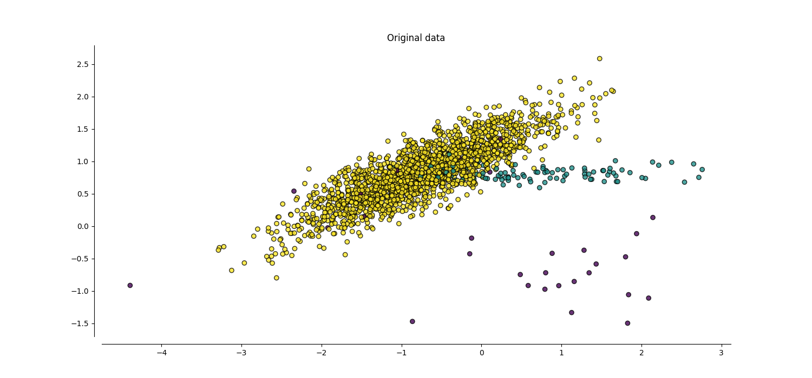
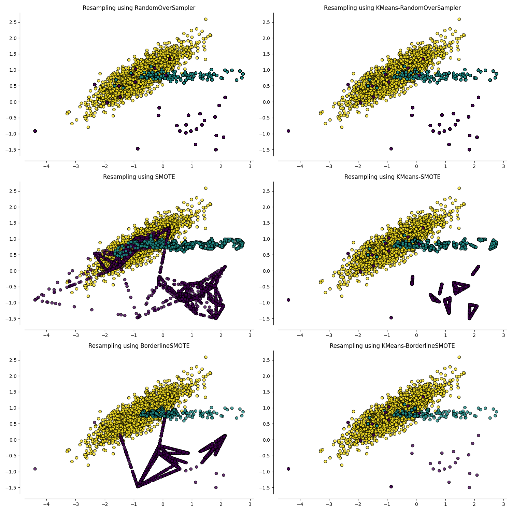

<!--
 DO NOT EDIT.
 THIS FILE WAS AUTOMATICALLY GENERATED BY mkdocs-gallery.
 TO MAKE CHANGES, EDIT THE SOURCE PYTHON FILE:
 "docs/examples/plot_cluster_oversamplers.py"
 LINE NUMBERS ARE GIVEN BELOW.
-->

!!! note

    Click [here](#download_links)
    to download the full example code


Clustering-based over-sampling
==============================

This example illustrates the data generation
process and the performance of various
over-samplers when clustering-based over-sampling
is used.

<!-- GENERATED FROM PYTHON SOURCE LINES 10-90 -->

```{.python }

# Author: Georgios Douzas <gdouzas@icloud.com>
# Licence: MIT

import matplotlib.pyplot as plt
import pandas as pd
from clover.over_sampling import ClusterOverSampler
from imblearn.over_sampling import SMOTE, BorderlineSMOTE, RandomOverSampler
from imblearn.pipeline import make_pipeline
from sklearn.base import clone
from sklearn.cluster import AgglomerativeClustering, KMeans
from sklearn.datasets import make_classification
from sklearn.ensemble import GradientBoostingClassifier
from sklearn.metrics import f1_score
from sklearn.model_selection import train_test_split

RANDOM_STATE = 0
OVERSAMPLERS = [
    RandomOverSampler(random_state=RANDOM_STATE),
    SMOTE(random_state=RANDOM_STATE + 1),
    BorderlineSMOTE(random_state=RANDOM_STATE + 2),
]
KMEANS = KMeans(random_state=RANDOM_STATE, n_clusters=100)
AGGL = AgglomerativeClustering(n_clusters=100)


def generate_imbalanced_data():
    """Generate imbalanced data."""
    X, y = make_classification(
        n_classes=3,
        class_sep=0.8,
        weights=[0.01, 0.05, 0.94],
        n_informative=2,
        n_redundant=0,
        n_repeated=0,
        n_features=2,
        n_clusters_per_class=1,
        n_samples=2000,
        random_state=RANDOM_STATE,
    )
    return X, y


def plot_data(X, y, oversampler, ax):
    """Plot original or resampled data."""
    if oversampler is None:
        X_res, y_res = X, y
        title = 'Original data'
    else:
        oversampler = clone(oversampler)
        X_res, y_res = oversampler.fit_resample(X, y)
        if not isinstance(oversampler, ClusterOverSampler):
            ovs_name = oversampler.__class__.__name__
            title = f'Resampling using {ovs_name}'
        else:
            clusterer_name = oversampler.clusterer.__class__.__name__
            ovs_name = oversampler.oversampler_.__class__.__name__
            title = f'Resampling using {clusterer_name}-{ovs_name}'
    ax.scatter(X_res[:, 0], X_res[:, 1], c=y_res, alpha=0.8, edgecolor='k')
    ax.spines['top'].set_visible(False)
    ax.spines['right'].set_visible(False)
    ax.get_xaxis().tick_bottom()
    ax.get_yaxis().tick_left()
    ax.spines['left'].set_position(('outward', 10))
    ax.spines['bottom'].set_position(('outward', 10))
    ax.set_title(title)


def compare_f1_scores(X_train, X_test, y_train, y_test, clf, oversampler, clusterer):
    """Compare F1 scores of oversamplers with and without clustering."""
    ovs_clf = make_pipeline(clone(oversampler), clf)
    clr_ovs_clf = make_pipeline(ClusterOverSampler(clone(oversampler), clusterer), clf)
    y_pred = ovs_clf.fit(X_train, y_train).predict(X_test)
    y_pred_clr = clr_ovs_clf.fit(X_train, y_train).predict(X_test)
    ovs_name = oversampler.__class__.__name__
    ovs_score = f1_score(y_test, y_pred, average='macro')
    clr_ovs_score = f1_score(y_test, y_pred_clr, average='macro')
    return (ovs_name, ovs_score, clr_ovs_score)


```


<!-- GENERATED FROM PYTHON SOURCE LINES 91-97 -->

Generate imbalanced data
------------------------


We are generating a highly imbalanced multi-class data set, using
``make_classification`` from scikit-learn.

<!-- GENERATED FROM PYTHON SOURCE LINES 97-102 -->

```{.python }

X, y = generate_imbalanced_data()
_, ax = plt.subplots(1, 1, figsize=(15, 7))
plot_data(X, y, None, ax)

```


{: .mkd-glr-single-img srcset="../images/mkd_glr_plot_cluster_oversamplers_001.png"}


<!-- GENERATED FROM PYTHON SOURCE LINES 103-111 -->

Effect of clustering to over-samplers
-------------------------------------

Clustering based over-sampling allows to identify areas of the input space
which are appropriate to generate artificial data. Therefore, the generation
of noisy samples is avoided and the within-classes imbalanced issue is also
addressed. The next plots show the resampled data when clustering is applied,
comparing them to the resampled data of the initial over-samplers.

<!-- GENERATED FROM PYTHON SOURCE LINES 111-118 -->

```{.python }

fig, axs = plt.subplots(3, 2, figsize=(15, 15))
for (ax1, ax2), oversampler in zip(axs, OVERSAMPLERS, strict=True):
    plot_data(X, y, clone(oversampler), ax1)
    plot_data(X, y, ClusterOverSampler(oversampler, KMEANS), ax2)
fig.tight_layout()

```


{: .mkd-glr-single-img srcset="../images/mkd_glr_plot_cluster_oversamplers_002.png"}

Out:
{: .mkd-glr-script-out }

```{.shell .mkd-glr-script-out-disp }
/Users/georgiosdouzas/Projects/personal/cluster-over-sampling/.venv/lib/python3.10/site-packages/sklearn/cluster/_kmeans.py:870: FutureWarning: The default value of `n_init` will change from 10 to 'auto' in 1.4. Set the value of `n_init` explicitly to suppress the warning
  warnings.warn(
/Users/georgiosdouzas/Projects/personal/cluster-over-sampling/.venv/lib/python3.10/site-packages/sklearn/cluster/_kmeans.py:870: FutureWarning: The default value of `n_init` will change from 10 to 'auto' in 1.4. Set the value of `n_init` explicitly to suppress the warning
  warnings.warn(
/Users/georgiosdouzas/Projects/personal/cluster-over-sampling/.venv/lib/python3.10/site-packages/sklearn/cluster/_kmeans.py:870: FutureWarning: The default value of `n_init` will change from 10 to 'auto' in 1.4. Set the value of `n_init` explicitly to suppress the warning
  warnings.warn(

```


<!-- GENERATED FROM PYTHON SOURCE LINES 119-124 -->

Performance evaluation of clustering based over-sampling
--------------------------------------------------------

We are evaluating various over-samplers using F1-score as evaluation metric
on a test set. The scores with and without clustering are compared.

<!-- GENERATED FROM PYTHON SOURCE LINES 124-138 -->

```{.python }

clf = GradientBoostingClassifier(random_state=RANDOM_STATE)
X_train, X_test, y_train, y_test = train_test_split(X, y, random_state=RANDOM_STATE)
scores = []
for oversampler in OVERSAMPLERS:
    scores.append(compare_f1_scores(X_train, X_test, y_train, y_test, clf, oversampler, KMEANS))
scores = (
    pd.DataFrame(scores)
    .rename(columns={0: 'Oversamplers', 1: ('F-score', 'No clustering'), 2: ('F-score', 'Clustering')})
    .set_index('Oversamplers')
)
scores.columns = pd.MultiIndex.from_tuples(scores.columns)
scores

```


Out:
{: .mkd-glr-script-out }

```{.shell .mkd-glr-script-out-disp }
/Users/georgiosdouzas/Projects/personal/cluster-over-sampling/.venv/lib/python3.10/site-packages/sklearn/cluster/_kmeans.py:870: FutureWarning: The default value of `n_init` will change from 10 to 'auto' in 1.4. Set the value of `n_init` explicitly to suppress the warning
  warnings.warn(
/Users/georgiosdouzas/Projects/personal/cluster-over-sampling/.venv/lib/python3.10/site-packages/sklearn/cluster/_kmeans.py:870: FutureWarning: The default value of `n_init` will change from 10 to 'auto' in 1.4. Set the value of `n_init` explicitly to suppress the warning
  warnings.warn(
/Users/georgiosdouzas/Projects/personal/cluster-over-sampling/.venv/lib/python3.10/site-packages/sklearn/cluster/_kmeans.py:870: FutureWarning: The default value of `n_init` will change from 10 to 'auto' in 1.4. Set the value of `n_init` explicitly to suppress the warning
  warnings.warn(

```


<div class="output_subarea output_html rendered_html output_result">
    <div>
    <style scoped>
        .dataframe tbody tr th:only-of-type {
            vertical-align: middle;
        }

        .dataframe tbody tr th {
            vertical-align: top;
        }

        .dataframe thead tr th {
            text-align: left;
        }

        .dataframe thead tr:last-of-type th {
            text-align: right;
        }
    </style>
    <table border="1" class="dataframe">
      <thead>
        <tr>
          <th></th>
          <th colspan="2" halign="left">F-score</th>
        </tr>
        <tr>
          <th></th>
          <th>No clustering</th>
          <th>Clustering</th>
        </tr>
        <tr>
          <th>Oversamplers</th>
          <th></th>
          <th></th>
        </tr>
      </thead>
      <tbody>
        <tr>
          <th>RandomOverSampler</th>
          <td>0.755701</td>
          <td>0.753091</td>
        </tr>
        <tr>
          <th>SMOTE</th>
          <td>0.611372</td>
          <td>0.742941</td>
        </tr>
        <tr>
          <th>BorderlineSMOTE</th>
          <td>0.759660</td>
          <td>0.765629</td>
        </tr>
      </tbody>
    </table>
    </div>
</div>


<!-- GENERATED FROM PYTHON SOURCE LINES 139-140 -->

We repeat the process for AgglomerativeClustering instead of KMeans.

<!-- GENERATED FROM PYTHON SOURCE LINES 140-151 -->

```{.python }

scores = []
for oversampler in OVERSAMPLERS:
    scores.append(compare_f1_scores(X_train, X_test, y_train, y_test, clf, oversampler, AGGL))
scores = (
    pd.DataFrame(scores)
    .rename(columns={0: 'Oversamplers', 1: ('F-score', 'No clustering'), 2: ('F-score', 'Clustering')})
    .set_index('Oversamplers')
)
scores.columns = pd.MultiIndex.from_tuples(scores.columns)
scores
```


<div class="output_subarea output_html rendered_html output_result">
    <div>
    <style scoped>
        .dataframe tbody tr th:only-of-type {
            vertical-align: middle;
        }

        .dataframe tbody tr th {
            vertical-align: top;
        }

        .dataframe thead tr th {
            text-align: left;
        }

        .dataframe thead tr:last-of-type th {
            text-align: right;
        }
    </style>
    <table border="1" class="dataframe">
      <thead>
        <tr>
          <th></th>
          <th colspan="2" halign="left">F-score</th>
        </tr>
        <tr>
          <th></th>
          <th>No clustering</th>
          <th>Clustering</th>
        </tr>
        <tr>
          <th>Oversamplers</th>
          <th></th>
          <th></th>
        </tr>
      </thead>
      <tbody>
        <tr>
          <th>RandomOverSampler</th>
          <td>0.755701</td>
          <td>0.737687</td>
        </tr>
        <tr>
          <th>SMOTE</th>
          <td>0.611372</td>
          <td>0.749518</td>
        </tr>
        <tr>
          <th>BorderlineSMOTE</th>
          <td>0.759660</td>
          <td>0.759660</td>
        </tr>
      </tbody>
    </table>
    </div>
</div>


**Total running time of the script:** ( 0 minutes  13.628 seconds)

<div id="download_links"></div>


[:fontawesome-solid-download: Download Python source code: plot_cluster_oversamplers.py](./plot_cluster_oversamplers.py){ .md-button .center}

[:fontawesome-solid-download: Download Jupyter notebook: plot_cluster_oversamplers.ipynb](./plot_cluster_oversamplers.ipynb){ .md-button .center}


[Gallery generated by mkdocs-gallery](https://mkdocs-gallery.github.io){: .mkd-glr-signature }
