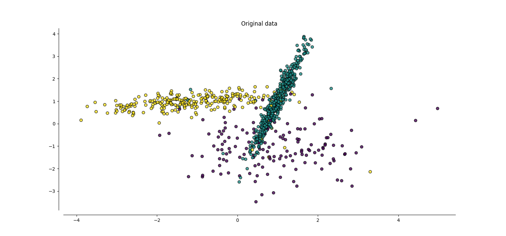
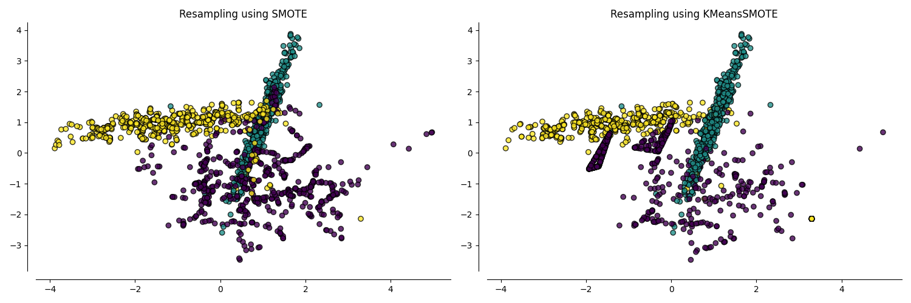

<!--
 DO NOT EDIT.
 THIS FILE WAS AUTOMATICALLY GENERATED BY mkdocs-gallery.
 TO MAKE CHANGES, EDIT THE SOURCE PYTHON FILE:
 "docs/examples/plot_kmeans_smote.py"
 LINE NUMBERS ARE GIVEN BELOW.
-->

!!! note

    Click [here](#download_links)
    to download the full example code


KMeans-SMOTE algorithm
======================

This example illustrates the data generation
process and the performance of KMeans-SMOTE.

<!-- GENERATED FROM PYTHON SOURCE LINES 8-76 -->

```{.python }

# Author: Georgios Douzas <gdouzas@icloud.com>
# Licence: MIT

import matplotlib.pyplot as plt
import pandas as pd
from clover.over_sampling import KMeansSMOTE
from imblearn.over_sampling import SMOTE
from imblearn.pipeline import make_pipeline
from sklearn.base import clone
from sklearn.datasets import make_classification
from sklearn.ensemble import GradientBoostingClassifier
from sklearn.metrics import f1_score
from sklearn.model_selection import train_test_split

RANDOM_STATE = 2
OVERSAMPLERS = [
    SMOTE(random_state=RANDOM_STATE),
    KMeansSMOTE(random_state=RANDOM_STATE + 3),
]


def generate_imbalanced_data():
    """Generate imbalanced data."""
    X, y = make_classification(
        n_classes=3,
        flip_y=0.05,
        weights=[0.15, 0.6, 0.25],
        n_informative=2,
        n_redundant=0,
        n_repeated=0,
        n_features=2,
        n_clusters_per_class=1,
        n_samples=1000,
        random_state=RANDOM_STATE,
    )
    return X, y


def plot_data(X, y, oversampler, ax):
    """Plot original or resampled data."""
    if oversampler is None:
        X_res, y_res = X, y
        title = 'Original data'
    else:
        oversampler = clone(oversampler)
        X_res, y_res = oversampler.fit_resample(X, y)
        ovs_name = oversampler.__class__.__name__
        title = f'Resampling using {ovs_name}'
    ax.scatter(X_res[:, 0], X_res[:, 1], c=y_res, alpha=0.8, edgecolor='k')
    ax.spines['top'].set_visible(False)
    ax.spines['right'].set_visible(False)
    ax.get_xaxis().tick_bottom()
    ax.get_yaxis().tick_left()
    ax.spines['left'].set_position(('outward', 10))
    ax.spines['bottom'].set_position(('outward', 10))
    ax.set_title(title)


def compare_f1_scores(X_train, X_test, y_train, y_test, clf, oversampler):
    """Compare F1 scores of oversamplers."""
    ovs_clf = make_pipeline(clone(oversampler), clf)
    y_pred = ovs_clf.fit(X_train, y_train).predict(X_test)
    ovs_name = oversampler.__class__.__name__
    ovs_score = f1_score(y_test, y_pred, average='macro')
    return (ovs_name, ovs_score)


```


Out:
{: .mkd-glr-script-out }

```{.shell .mkd-glr-script-out-disp }
/Users/georgiosdouzas/Projects/personal/cluster-over-sampling/.venv/lib/python3.10/site-packages/nptyping/typing_.py:51: DeprecationWarning: `np.bool8` is a deprecated alias for `np.bool_`.  (Deprecated NumPy 1.24)
  Bool8 = np.bool8
/Users/georgiosdouzas/Projects/personal/cluster-over-sampling/.venv/lib/python3.10/site-packages/nptyping/typing_.py:54: DeprecationWarning: `np.object0` is a deprecated alias for ``np.object0` is a deprecated alias for `np.object_`. `object` can be used instead.  (Deprecated NumPy 1.24)`.  (Deprecated NumPy 1.24)
  Object0 = np.object0
/Users/georgiosdouzas/Projects/personal/cluster-over-sampling/.venv/lib/python3.10/site-packages/nptyping/typing_.py:66: DeprecationWarning: `np.int0` is a deprecated alias for `np.intp`.  (Deprecated NumPy 1.24)
  Int0 = np.int0
/Users/georgiosdouzas/Projects/personal/cluster-over-sampling/.venv/lib/python3.10/site-packages/nptyping/typing_.py:80: DeprecationWarning: `np.uint0` is a deprecated alias for `np.uintp`.  (Deprecated NumPy 1.24)
  UInt0 = np.uint0
/Users/georgiosdouzas/Projects/personal/cluster-over-sampling/.venv/lib/python3.10/site-packages/nptyping/typing_.py:107: DeprecationWarning: `np.void0` is a deprecated alias for `np.void`.  (Deprecated NumPy 1.24)
  Void0 = np.void0
/Users/georgiosdouzas/Projects/personal/cluster-over-sampling/.venv/lib/python3.10/site-packages/nptyping/typing_.py:112: DeprecationWarning: `np.bytes0` is a deprecated alias for `np.bytes_`.  (Deprecated NumPy 1.24)
  Bytes0 = np.bytes0
/Users/georgiosdouzas/Projects/personal/cluster-over-sampling/.venv/lib/python3.10/site-packages/nptyping/typing_.py:114: DeprecationWarning: `np.str0` is a deprecated alias for `np.str_`.  (Deprecated NumPy 1.24)
  Str0 = np.str0

```


<!-- GENERATED FROM PYTHON SOURCE LINES 77-82 -->

Generate imbalanced data
------------------------

We are generating an imbalanced multi-class data set, using
``make_classification`` from scikit-learn.

<!-- GENERATED FROM PYTHON SOURCE LINES 82-87 -->

```{.python }

X, y = generate_imbalanced_data()
_, ax = plt.subplots(1, 1, figsize=(15, 7))
plot_data(X, y, None, ax)

```


{: .mkd-glr-single-img srcset="../images/mkd_glr_plot_kmeans_smote_001.png"}


<!-- GENERATED FROM PYTHON SOURCE LINES 88-95 -->

Plot resampled data
-------------------

KMeans-SMOTE allows to identify areas of the input space which are appropriate to generate
artificial data. Therefore, the generation of noisy samples is avoided and the within-classes
imbalanced issue is also addressed. The next plots show the resampled data of
KMeans-SMOTE vs SMOTE.

<!-- GENERATED FROM PYTHON SOURCE LINES 95-101 -->

```{.python }

fig, axs = plt.subplots(1, 2, figsize=(15, 5))
for ax, oversampler in zip(axs, OVERSAMPLERS, strict=True):
    plot_data(X, y, clone(oversampler), ax)
fig.tight_layout()

```


{: .mkd-glr-single-img srcset="../images/mkd_glr_plot_kmeans_smote_002.png"}

Out:
{: .mkd-glr-script-out }

```{.shell .mkd-glr-script-out-disp }
/Users/georgiosdouzas/Projects/personal/cluster-over-sampling/.venv/lib/python3.10/site-packages/sklearn/cluster/_kmeans.py:870: FutureWarning: The default value of `n_init` will change from 3 to 'auto' in 1.4. Set the value of `n_init` explicitly to suppress the warning
  warnings.warn(

```


<!-- GENERATED FROM PYTHON SOURCE LINES 102-107 -->

Performance evaluation
----------------------

We are evaluating the performance of KMeans-SMOTE using F1-score as evaluation metric on a
test set. SMOTE's performance is also included.

<!-- GENERATED FROM PYTHON SOURCE LINES 107-114 -->

```{.python }

clf = GradientBoostingClassifier(random_state=RANDOM_STATE)
X_train, X_test, y_train, y_test = train_test_split(X, y, random_state=RANDOM_STATE)
scores = []
for oversampler in OVERSAMPLERS:
    scores.append(compare_f1_scores(X_train, X_test, y_train, y_test, clf, oversampler))
pd.DataFrame(scores).rename(columns={0: 'Oversamplers', 1: 'F-score'}).set_index('Oversamplers')
```


Out:
{: .mkd-glr-script-out }

```{.shell .mkd-glr-script-out-disp }
/Users/georgiosdouzas/Projects/personal/cluster-over-sampling/.venv/lib/python3.10/site-packages/sklearn/cluster/_kmeans.py:870: FutureWarning: The default value of `n_init` will change from 3 to 'auto' in 1.4. Set the value of `n_init` explicitly to suppress the warning
  warnings.warn(

```


<div class="output_subarea output_html rendered_html output_result">
    <div>
    <style scoped>
        .dataframe tbody tr th:only-of-type {
            vertical-align: middle;
        }

        .dataframe tbody tr th {
            vertical-align: top;
        }

        .dataframe thead th {
            text-align: right;
        }
    </style>
    <table border="1" class="dataframe">
      <thead>
        <tr style="text-align: right;">
          <th></th>
          <th>F-score</th>
        </tr>
        <tr>
          <th>Oversamplers</th>
          <th></th>
        </tr>
      </thead>
      <tbody>
        <tr>
          <th>SMOTE</th>
          <td>0.848706</td>
        </tr>
        <tr>
          <th>KMeansSMOTE</th>
          <td>0.871661</td>
        </tr>
      </tbody>
    </table>
    </div>
</div>


**Total running time of the script:** ( 0 minutes  4.784 seconds)

<div id="download_links"></div>


[:fontawesome-solid-download: Download Python source code: plot_kmeans_smote.py](./plot_kmeans_smote.py){ .md-button .center}

[:fontawesome-solid-download: Download Jupyter notebook: plot_kmeans_smote.ipynb](./plot_kmeans_smote.ipynb){ .md-button .center}


[Gallery generated by mkdocs-gallery](https://mkdocs-gallery.github.io){: .mkd-glr-signature }
